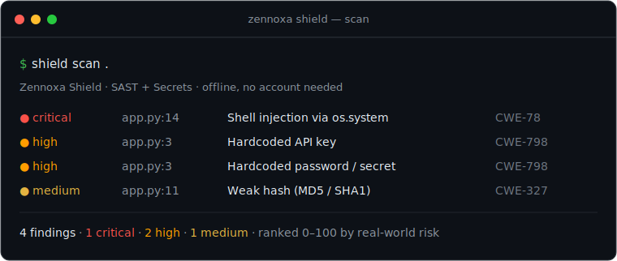

<div align="center">

# 🛡️ Zennoxa Shield

**Find, prioritize & fix code security risks — one scan, every layer.**

[Website](https://zennoxa.com) · [Report an issue](https://github.com/Zennoxa/shield/issues)

[](https://github.com/Zennoxa/shield/releases/latest)
[](./LICENSE)


</div>

<p align="center">
  
</p>


---

Zennoxa Shield is a DevSecOps platform that scans your source code, dependencies, secrets, containers, and infrastructure-as-code for security vulnerabilities — then ranks what to fix first by real-world risk, so you spend time on the issues that actually matter.

> **This repository** hosts the **Shield CLI releases, documentation, and community issue tracker.** The scanning engine and dashboard are a hosted product at **[zennoxa.com](https://zennoxa.com)** — free during beta.

## What it checks

| Layer | What Shield finds |
| --- | --- |
| **Code (SAST)** | Insecure patterns across **14 languages** — injection, XSS, weak crypto, unsafe deserialization, and more |
| **Secrets** | **26 credential patterns** — cloud keys, tokens, private keys, database URLs, provider API keys |
| **Dependencies (SCA)** | Known CVEs via **[OSV.dev](https://osv.dev)** + a **CycloneDX 1.4 SBOM** |
| **Containers** | Dockerfile misconfigurations and image scanning |
| **Infrastructure-as-Code** | Terraform & Kubernetes misconfigurations *(hosted)* |
| **License compliance** | Dependency license risks *(hosted)* |
| **Prioritization** | A **0–100 risk score** per finding — severity + code reachability — so the noise sinks and the exploitable issues rise |

## Supported languages (SAST)

C · C++ · C# · Dart · Go · Java · JavaScript · Kotlin · PHP · Python · Ruby · Rust · Swift · TypeScript — plus **YAML · Terraform · Kubernetes · CloudFormation** for config/IaC.

## How Shield compares
> 📊 **Full evidence — every target we tested (OWASP Benchmark · Juice Shop · WebGoat · DVNA · Kubernetes Goat · terragoat), per scan layer, with reproduce commands → [docs/EVIDENCE.md](docs/EVIDENCE.md)**


_Comparison as of 2026-07-18. Every figure we measure ourselves is reproducible with the stated `make` command. Figures attributed to OWASP are reproduced from OWASP's independently published scorecards. All tools are run at their default, out-of-the-box configuration; results may vary with tool version, configuration, ruleset, and codebase. Ordering in the tables reflects the stated metric value only and is not a general quality ranking._

### OWASP Benchmark v1.2 (third-party test suite)

The [OWASP Benchmark](https://owasp.org/www-project-benchmark/) is a public suite of **2,740 labelled Java test cases** (score = True Positive Rate − False Positive Rate, higher is better). Shield scores a **Benchmark Score of +0.450 at 92.8% precision**, reproducible with our harness against the public suite. To see how other tools score, check OWASP's own published scorecards. Shield's recall on this suite is ~46% — consistent with our precision-first design (see the note below).

### Dependency (SCA) scanning — worked example on one project

This is an illustrative worked example on a **single real Node.js project at a pinned commit**, not a multi-project benchmark.

Ground truth is **9 known-vulnerable advisories** for this project (undici, dompurify, form-data), each independently verifiable in public advisory databases (GitHub Advisory / OSV). **Shield detected all 9.** The advisory IDs are listed alongside the harness so the ground truth can be checked externally — verify each, then run any SCA tool at its default configuration on the same commit to compare for yourself.

### Reproduce it yourself

- **OWASP Benchmark:** the suite is public — install the Shield CLI (above) and run it against [OWASP-Benchmark/BenchmarkJava](https://github.com/OWASP-Benchmark/BenchmarkJava), then score with OWASP's own scoring tool. The competitor rows can be checked directly against OWASP's [published Benchmark scorecards](https://owasp.org/www-project-benchmark/).
- **Dependency example:** the 9 advisories are public GitHub Advisory / OSV entries — verify each in those databases and re-run any listed tool at its default configuration on the same project and commit.

Shield runs SAST, Secrets, SCA, Container, and CI/CD checks in a single offline scan, with findings ranked 0-100 using severity, exploitability signals (EPSS/KEV where a CVE is known), and reachability.

### A note on precision

Shield is **precision-first**: it is tuned to keep false positives low so that the findings you see are the ones worth acting on. As a trade-off, on some datasets its recall is not the highest — on OWASP v1.2, for example, Shield reaches 92.8% precision at roughly 46% recall. We think fewer, higher-confidence findings are the right default — and because every benchmark we measure is reproducible, you can measure the trade-off for your own code.

---

_"OWASP" and "OWASP Benchmark" are trademarks of the OWASP Foundation, used here for identification only; this project is not affiliated with, endorsed by, or sponsored by the OWASP Foundation. The OWASP Benchmark test suite is used under its open-source license._

## Install the CLI

Grab the latest binary for your platform from **[Releases](https://github.com/Zennoxa/shield/releases/latest)**.

**macOS / Linux**
```bash
# pick your platform: shield-linux-amd64 · shield-linux-arm64 · shield-darwin-amd64 · shield-darwin-arm64
curl -L https://github.com/Zennoxa/shield/releases/latest/download/shield-darwin-arm64 -o shield
chmod +x shield && sudo mv shield /usr/local/bin/shield
shield version
```

**Windows** — download `shield-windows-amd64.exe` from Releases and add it to your `PATH`.

## Quick start

```bash
# Scan a project locally — SAST + secrets, no account needed
shield scan .

# Add dependency (SCA) analysis
shield scan . --deps

# Scan a container image
shield image-scan myorg/myapp:1.4

# Log in and submit results to your dashboard
shield login
shield scan . --submit --project YOUR-PROJECT-ID --org YOUR-ORG-ID
```

Browse and triage findings at **[zennoxa.com](https://zennoxa.com)**.

## Use it in CI

Add the **Zennoxa Shield GitHub Action** — one step, no manual install:

```yaml
# .github/workflows/security.yml
name: Security
on: [push, pull_request]
jobs:
  shield:
    runs-on: ubuntu-latest
    steps:
      - uses: actions/checkout@v4
      - uses: Zennoxa/shield@v0.1.0     # pin to a tag or commit SHA
        with:
          args: --deps                 # also scan dependencies (SCA)
          fail-on-findings: false      # set true to block PRs on findings
```

Inputs: `path` (default `.`), `args`, `version` (default `latest`), `fail-on-findings`. More in [`examples/`](examples/).

## How prioritization works

Most scanners drown you in findings. Shield scores every finding **0–100** by combining its **vulnerability severity** with **code reachability** (is the risky code actually reachable?), so the list is sorted by what's genuinely exploitable — not just what's noisy. You fix the top of the list and move on.

## FAQ

**Is it free?** Yes — free during beta, no credit card required. The CLI and documentation in this repo are MIT-licensed.

**Does my code leave my machine?** `shield scan .` runs locally. Results are only uploaded when you pass `--submit` to send them to your dashboard.

**Which languages are supported?** 14 for SAST (see the list above). Secrets, dependency, and container scanning are language-agnostic.

**Can I run it in CI?** Yes — see the GitHub Actions example above. Any CI that can run a binary works.

## Community & support

- 🐛 **Bugs / feature requests** → [open an issue](https://github.com/Zennoxa/shield/issues)
- 🔒 **Found a security vulnerability?** → please report it privately via [GitHub Security Advisories](https://github.com/Zennoxa/shield/security/advisories/new). See [SECURITY.md](./SECURITY.md).
- 🤝 **Contributing** → [CONTRIBUTING.md](./CONTRIBUTING.md)
- 🌐 **Product & sign-up** → [zennoxa.com](https://zennoxa.com)

## License

The CLI and documentation in this repository are released under the [MIT License](./LICENSE). The hosted scanning engine and dashboard are a separate, proprietary product.

---

<div align="center">© Zennoxa · <a href="https://zennoxa.com">zennoxa.com</a></div>
