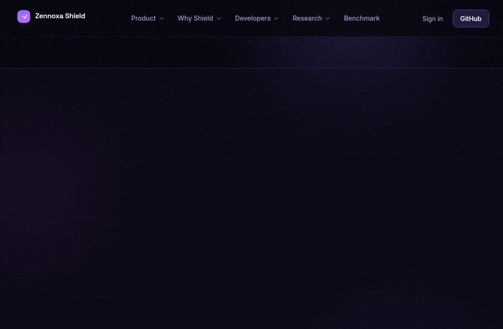
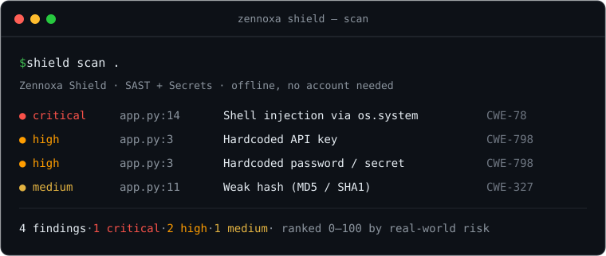
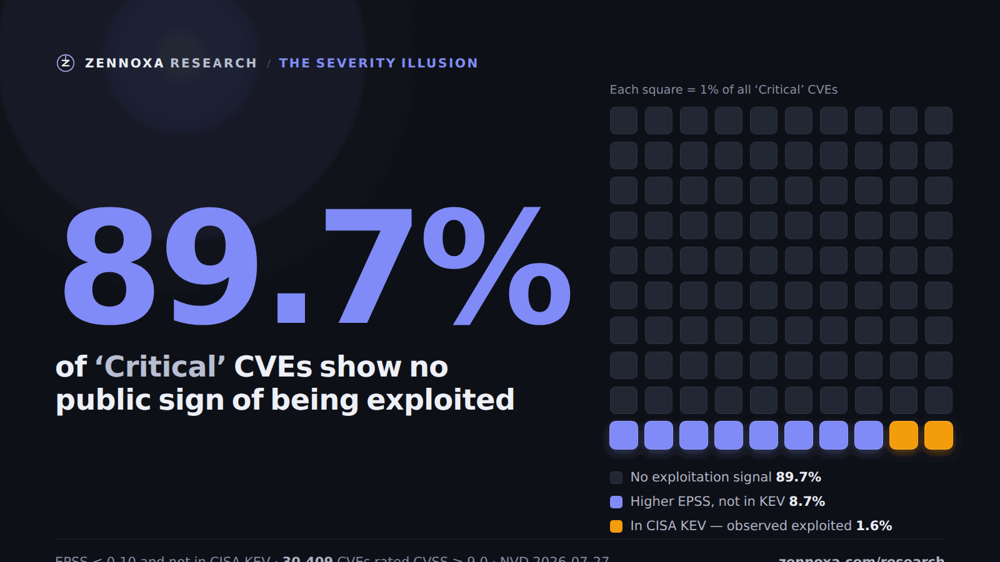

<div align="center">

# Zennoxa Shield

**Find, prioritize & fix code security risks — one scan, every layer.**

[Website](https://zennoxa.com) · [Report an issue](https://github.com/Zennoxa/shield/issues)

[](https://github.com/Zennoxa/shield/releases/latest)
[](./LICENSE)


[](./bench/owasp/benchmark.json)

</div>

<p align="center">
  
</p>

<p align="center"><em>Shield's <b>Priority Engine</b> re-orders findings by real-world exploitability — the reachable, exploitable bug rises to the top.<br><sub>Hosted dashboard shown. The free <code>shield</code> CLI reports the same findings with severity and CVSS in text, JSON, and SARIF; the 0–100 Priority Engine score is computed by the hosted service.</sub></em></p>

<p align="center">
  
</p>


---

**Zennoxa Shield is a security scanner for the whole software delivery lifecycle.** In a single pass it runs static analysis (SAST), secret scanning, dependency / software-composition analysis (SCA), container and infrastructure-as-code (IaC) checks over your codebase — then ranks every finding by real-world exploitability, so you fix what actually matters instead of a wall of "critical" alerts.

The `shield` CLI in this repository is free and MIT-licensed, runs locally from the command line, and outputs **SARIF** for GitHub code scanning and CI security gates across **24 programming languages** (dependency scanning pulls advisory data over the network). What sets Shield apart from most scanners is its **Priority Engine**, which blends CVSS, EPSS, CISA KEV and code reachability into one **0–100 exploitability score** so the findings that actually matter rise to the top. That 0–100 score is produced by the hosted engine; the free CLI reports each finding with its severity and CVSS.

> **This repository** hosts the **Shield CLI releases, documentation, and community issue tracker.** The scanning engine and dashboard are a hosted product at **[zennoxa.com](https://zennoxa.com)** — free during beta.

## Latest research

**The Severity Illusion — 9 in 10 "Critical" CVEs show no sign of being exploited.**
We joined three public datasets (NVD CVSS · FIRST EPSS · CISA KEV) across all
30,409 CVSS-9.0+ CVEs: **89.7%** sit below an EPSS exploitation probability of
0.10 *and* never appear in CISA's Known Exploited Vulnerabilities catalog — only
**1.6%** are in KEV. Every figure is reproducible from the three public snapshots.

→ **Read the study:** https://zennoxa.com/research/severity-illusion-critical-cves-2026

<p align="center">
  <a href="https://zennoxa.com/research/severity-illusion-critical-cves-2026">
    
  </a>
</p>

_This is exactly what Shield's Priority Engine solves: it blends CVSS, EPSS, KEV
and reachability into one 0–100 score so the ~10% that actually matter rise first._

## What it checks

| Layer | What Shield finds |
| --- | --- |
| **Code (SAST)** | Insecure patterns across **24 languages** (14 with comprehensive coverage) — injection, XSS, weak crypto, unsafe deserialization, and more |
| **Secrets** | **26 credential patterns** — cloud keys, tokens, private keys, database URLs, provider API keys |
| **Dependencies (SCA)** | Known CVEs via **[OSV.dev](https://osv.dev)** + a **CycloneDX 1.4 SBOM** |
| **Containers** | Dockerfile misconfigurations and image scanning |
| **Infrastructure-as-Code** | Terraform & Kubernetes misconfigurations *(hosted)* |
| **License compliance** | Dependency license risks *(hosted)* |
| **Priority Engine** | A **0–100 risk score** per finding — CVSS + EPSS + CISA KEV + code reachability — so the noise sinks and the exploitable issues rise |

## Supported languages (SAST)

**14 with comprehensive coverage:** C · C++ · C# · Dart · Go · Java · JavaScript · Kotlin · PHP · Python · Ruby · Rust · Swift · TypeScript

**Plus lighter coverage for 10+ more:** Scala · Solidity · PowerShell · Groovy · Lua · Perl · Objective-C · VB.NET · Shell · SQL · Vyper

— and **YAML · Terraform · Kubernetes · CloudFormation · Dockerfile · Helm** for config / IaC.

## How Shield compares
> **Full evidence — every target we tested (OWASP Benchmark · Juice Shop · WebGoat · DVNA · Kubernetes Goat · terragoat), per scan layer, with reproduce commands → [docs/EVIDENCE.md](docs/EVIDENCE.md)**


_Comparison as of 2026-07-18. Every figure we measure ourselves is reproducible with the released CLI. Figures attributed to OWASP are reproduced from OWASP's independently published scorecards. All tools are run at their default, out-of-the-box configuration; results may vary with tool version, configuration, ruleset, and codebase. Ordering in the tables reflects the stated metric value only and is not a general quality ranking._

### OWASP Benchmark v1.2 (third-party test suite)

The [OWASP Benchmark](https://owasp.org/www-project-benchmark/) is a public suite of **2,740 labelled Java test cases** (score = True Positive Rate − False Positive Rate, higher is better). Shield scores a **Benchmark Score of +0.582 at 92.5% precision** (recall 63.7%, false-positive rate 5.5%) — see [`bench/owasp/benchmark.json`](bench/owasp/benchmark.json) for the full per-category breakdown and reproduce steps. To see how other tools score, check OWASP's own published scorecards. Shield's recall on this suite is ~64% — consistent with our precision-first design (see the note below).

### Dependency (SCA) scanning — worked example on one project

This is an illustrative worked example on a **single real Node.js project at a pinned commit**, not a multi-project benchmark.

Ground truth is **9 known-vulnerable advisories** for this project (undici, dompurify, form-data), each independently verifiable in public advisory databases (GitHub Advisory / OSV). **Shield detected all 9.** The advisory IDs are listed alongside the harness so the ground truth can be checked externally — verify each, then run any SCA tool at its default configuration on the same commit to compare for yourself.

### Reproduce it yourself

- **OWASP Benchmark:** the suite is public — install the Shield CLI (above) and run it against [OWASP-Benchmark/BenchmarkJava](https://github.com/OWASP-Benchmark/BenchmarkJava), then score with OWASP's own scoring tool. The competitor rows can be checked directly against OWASP's [published Benchmark scorecards](https://owasp.org/www-project-benchmark/).
- **Dependency example:** the 9 advisories are public GitHub Advisory / OSV entries — verify each in those databases and re-run any listed tool at its default configuration on the same project and commit.

Shield runs SAST, Secrets, SCA, Container, and CI/CD checks in one pass (dependency scanning needs network access for advisory data). The hosted engine then ranks findings 0-100 using severity, exploitability signals (EPSS/KEV where a CVE is known), and reachability; the free CLI reports each finding's severity and CVSS.

### A note on precision

Shield is **precision-first**: it is tuned to keep false positives low so that the findings you see are the ones worth acting on. As a trade-off, on some datasets its recall is not the highest — on OWASP v1.2, for example, Shield reaches 92.5% precision at roughly 64% recall. We think fewer, higher-confidence findings are the right default — and because every benchmark we measure is reproducible, you can measure the trade-off for your own code.

---

_"OWASP" and "OWASP Benchmark" are trademarks of the OWASP Foundation, used here for identification only; this project is not affiliated with, endorsed by, or sponsored by the OWASP Foundation. The OWASP Benchmark test suite is used under its open-source license._

## Install the CLI

### Homebrew (macOS / Linux)

```bash
brew install zennoxa/tap/shield
shield version
```

### Direct download

Grab the latest binary from **[Releases](https://github.com/Zennoxa/shield/releases/latest)** — optionally verifying it against the published `SHA256SUMS`.

```bash
# pick your platform: shield-linux-amd64 · shield-linux-arm64 · shield-darwin-amd64 · shield-darwin-arm64
curl -LO https://github.com/Zennoxa/shield/releases/latest/download/shield-darwin-arm64
curl -LO https://github.com/Zennoxa/shield/releases/latest/download/SHA256SUMS

# verify the download (prints "shield-darwin-arm64: OK")
# macOS: shasum -a 256 -c SHA256SUMS --ignore-missing
sha256sum --ignore-missing --check SHA256SUMS

# install onto your PATH
chmod +x shield-darwin-arm64 && sudo mv shield-darwin-arm64 /usr/local/bin/shield
shield version
```

**Windows** — download `shield-windows-amd64.exe` from Releases and add it to your `PATH`.

## Quick start

```bash
# Scan a project locally — SAST + secrets, no account needed
shield scan .

# Add dependency (SCA) analysis
shield scan . --deps

# Scan a container image
shield image-scan myorg/myapp:1.4

# Log in and submit results to your dashboard
shield login
shield scan . --submit --project YOUR-PROJECT-ID --org YOUR-ORG-ID
```

Browse and triage findings at **[zennoxa.com](https://zennoxa.com)**.

## Pre-commit hook

Run Shield before every commit with [pre-commit](https://pre-commit.com). Install the `shield` CLI first (Homebrew or a release binary above), then add to your project's `.pre-commit-config.yaml`:

```yaml
repos:
  - repo: https://github.com/Zennoxa/shield
    rev: v0.3.0
    hooks:
      - id: shield
```

```bash
pre-commit install
pre-commit run shield --all-files
```

The hook scans your repository and blocks the commit if Shield finds an issue (bypass with `git commit --no-verify`).

## Use it in CI

Add the **Zennoxa Shield GitHub Action** — one step, no manual install:

```yaml
# .github/workflows/security.yml
name: Security
on: [push, pull_request]
jobs:
  shield:
    runs-on: ubuntu-latest
    steps:
      - uses: actions/checkout@v4
      - uses: Zennoxa/shield@v0.3.0     # pin to a tag or commit SHA
        with:
          args: --deps                 # also scan dependencies (SCA)
          fail-on-findings: false      # set true to block PRs on findings
```

Inputs: `path` (default `.`), `args`, `version` (default `latest`), `fail-on-findings`. More in [`examples/`](examples/).

## How prioritization works — the Priority Engine

Most scanners drown you in findings. Shield's **Priority Engine** scores every finding **0–100** from four signals, not just severity:

```
Priority = CVSS·0.30 + EPSS·0.30 + KEV·0.25 + reachability·0.15
```

- **CVSS** — the vulnerability's base severity.
- **EPSS** — FIRST.org's probability it will be exploited in the wild in the next 30 days (where a CVE is known).
- **CISA KEV** — whether it appears in the Known Exploited Vulnerabilities catalog (proven exploited in the real world).
- **Reachability** — whether the risky code is actually reachable from an entry point.

So the list sorts by what's genuinely exploitable — not just what's noisy. You fix the top and move on.

## FAQ

**What is Zennoxa Shield?** Zennoxa Shield is a security scanner that finds vulnerabilities across your code (SAST), dependencies (SCA), secrets, containers and infrastructure-as-code in a single scan, then ranks every finding **0–100** by real-world exploitability. The `shield` CLI in this repo is free and MIT-licensed; a hosted dashboard at [zennoxa.com](https://zennoxa.com) adds team and organization features.

**Is the `shield` CLI free? How is it licensed?** The `shield` CLI and the documentation in this repository are [MIT-licensed](./LICENSE) and free to use — run it in CI, redistribute it, no account. The hosted scanning engine and dashboard at zennoxa.com are a separate, proprietary product.

**Is it free?** Yes — free during beta, no credit card required. The CLI and documentation in this repo are MIT-licensed.

**Does my code leave my machine?** `shield scan .` runs locally. Results are only uploaded when you pass `--submit` to send them to your dashboard.

**Which languages are supported?** 24 for SAST — 14 with comprehensive coverage plus lighter coverage for 10+ more (see the list above). Secrets, dependency, and container scanning are language-agnostic.

**Does Shield output SARIF / work with GitHub code scanning?** Yes. `shield scan . --format sarif` emits [SARIF](https://sarifweb.azurewebsites.net/) you can upload to GitHub code scanning or feed to any SARIF-aware CI or security gate. See the GitHub Action example above.

**How is Shield different from Snyk, Semgrep, SonarQube or Trivy?** Most scanners hand you a long list sorted by raw severity. Shield's **Priority Engine** ranks findings by *exploitability* — blending CVSS, EPSS, CISA KEV and code reachability — so you act on the ~10% that actually matter, and it covers multiple layers (SAST + secrets + SCA + container + IaC) in one pass. The 0–100 exploitability ranking is produced by the hosted engine; the free CLI reports findings with severity and CVSS. Rather than take our word for it: every benchmark we publish is reproducible, so you can run any tool at its defaults on your own code and compare.

**Can I run it in CI?** Yes — see the GitHub Actions example above. Any CI that can run a binary works.

## Contributors welcome

New here? We've labelled a handful of **[good first issues](https://github.com/Zennoxa/shield/labels/good%20first%20issue)** — CI examples (GitLab, Bitbucket, Jenkins), a SARIF → GitHub code-scanning guide, and an example `.shieldignore`. They're self-contained, need no engine internals, and get reviewed quickly. Open a PR or say hi in an issue — see [CONTRIBUTING.md](./CONTRIBUTING.md).

## Community & support

- **Bugs / feature requests** → [open an issue](https://github.com/Zennoxa/shield/issues)
- **Found a security vulnerability?** → please report it privately via [GitHub Security Advisories](https://github.com/Zennoxa/shield/security/advisories/new). See [SECURITY.md](./SECURITY.md).
- **Contributing** → [CONTRIBUTING.md](./CONTRIBUTING.md)
- **Product & sign-up** → [zennoxa.com](https://zennoxa.com)

## License

The CLI and documentation in this repository are released under the [MIT License](./LICENSE). The hosted scanning engine and dashboard are a separate, proprietary product.

---

<div align="center">© Zennoxa · <a href="https://zennoxa.com">zennoxa.com</a></div>
